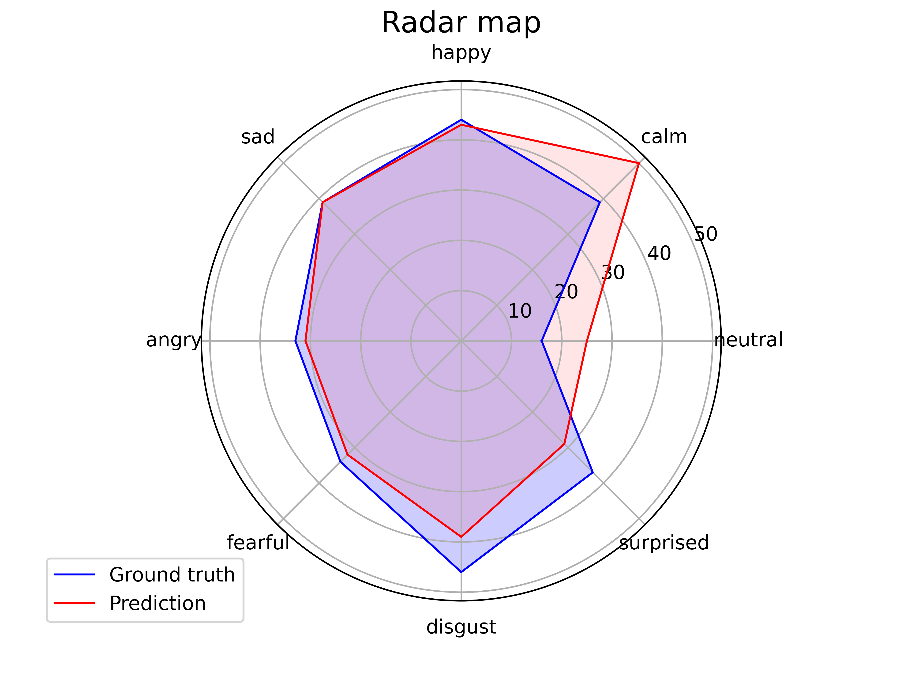

# Speech Emotion Recognization

Hi, here....

```
  ____    _____   ____  
 / ___|  | ____|   |  _ \ 
 \___ \  |  _|    | |_) |
  ___) | | |___   |  _ < 
 |____/  |_____|  |_| \_\  
```

## 🔍Dataset

Download dataset from kaggle [Ryerson Audio-Visual Database of Emotional Speech and Song (RAVDESS)](https://www.kaggle.com/datasets/uwrfkaggler/ravdess-emotional-speech-audio).

### 1.1 Files

​	This portion of the RAVDESS contains 1440 files: 60 trials per actor x 24 actors = 1440. The RAVDESS contains 24 professional actors (12 female, 12 male), vocalizing two lexically-matched statements in a neutral North American accent. Speech emotions includes calm, happy, sad, angry, fearful, surprise, and disgust expressions. Each expression is produced at two levels of emotional intensity (normal, strong), with an additional neutral expression.


### 1.2 File naming convention

​	Each of the 1440 files has a unique filename. The filename consists of a 7-part numerical identifier (e.g., 03-01-06-01-02-01-12.wav). These identifiers define the stimulus characteristics:

*Filename identifiers*

- Modality (01 = full-AV, 02 = video-only, 03 = audio-only).
- Vocal channel (01 = speech, 02 = song).
- Emotion (01 = neutral, 02 = calm, 03 = happy, 04 = sad, 05 = angry, 06 = fearful, 07 = disgust, 08 = surprised).
- Emotional intensity (01 = normal, 02 = strong). NOTE: There is no strong intensity for the 'neutral' emotion.
- Statement (01 = "Kids are talking by the door", 02 = "Dogs are sitting by the door").
- Repetition (01 = 1st repetition, 02 = 2nd repetition).
- Actor (01 to 24. Odd numbered actors are male, even numbered actors are female).

*Filename example: 03-01-06-01-02-01-12.wav*

1. Audio-only (03)
2. Speech (01)
3. Fearful (06)
4. Normal intensity (01)
5. Statement "dogs" (02)
6. 1st Repetition (01)
7. 12th Actor (12)
   Female, as the actor ID number is even.

A file is about 3.0s, waveform is like:


## 🚀Introduce

### 2.1 create virtual environment 
```bash
python -m venv myenv
```
### 2.2 Activate virtual env

If you use Linux

```bash
source myenv/bin/activate    # deactivate
```

or use windows, in CMD

```bash
myenv/Scripts/activate.bat
```

or in Powershell

```bash
myenv/Scripts/Activate.ps1
```

### 2.3 Install dependences

`pip install -r requirements.txt`

## 🎯Download checkpoint

Download checkpoints by [BaiduNetDisk](https://pan.baidu.com/s/1GqLkkeJ-nS2RpxnairJP5A?pwd=xuwe).

> All you needed is just `init` directory and `SSR_checkpoint.pt` file.

`SSR_checkpoint.pt` is simplified checkpoint of `step-149`. Although you can specify the step size (50, 100, 150), however, according to my experiment, step = win has the best effect. if you need checkpoints of other steps ,you can download `step-50` or `step-100`.


Notice that there are redundance parameters in .pth file of `step-xxx` directory, including scheduler params、optimizer params and so on.

## 🏆Evaluation

On the test dataset, here are some metrics.

### 4.1 Metric scores:


### 4.2 Confusion matrix:


### 4.3 Radar chart:




